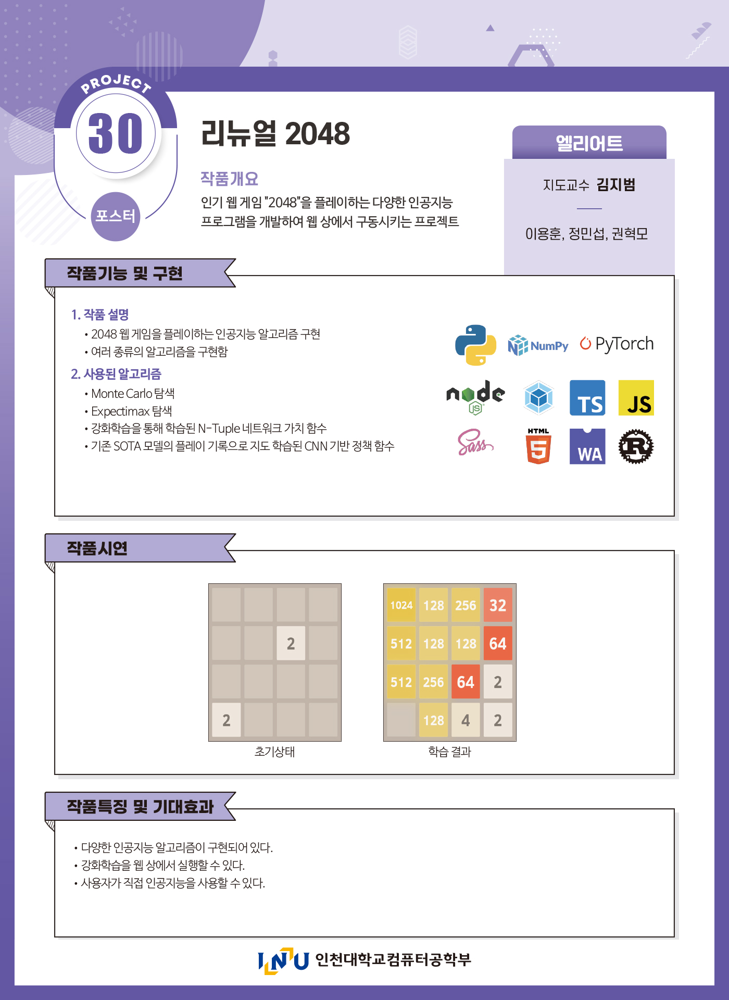

# Renewal 2048
인천대학교 컴퓨터공학부 캡스톤 디자인 프로젝트

총 네 가지의 알고리즘이 구현되어 있습니다. 자세한 구현 사항, 점수 기록 및 학습된 체크포인트는 [`/train`](https://github.com/nonzerofloat/2048/tree/master/train) 디렉토리를 참고하시기 바랍니다.
- Monte Carlo Search
- Expectimax Tree Search
- (RL) TD(0)-Prediction with N-Tuple Network
- (SL) Supervised learning with CNN

---

Based on [Gabriele Cirulli's "2048"](https://github.com/gabrielecirulli/2048)